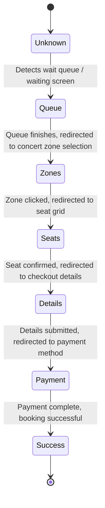

# Nongkapi TTM Helper - System Context & Architecture

This document provides a comprehensive overview of the architecture, component relationships, and automation state machine of the **Nongkapi TTM Helper** Chrome Extension.

---

## 1. System Overview

The **Nongkapi TTM Helper** is a standalone Manifest V3 Chrome Extension designed to automate and guide the ticket booking workflow on **ThaiTicketMajor (TTM)**.

All operations, settings storage, and automation runs are 100% client-side:
- **No external backend or admin panel**: Pure offline execution.
- **Local Storage (`chrome.storage.local`)**: Persists user booking presets and form drafts securely within the browser.
- **Side Panel Interface**: React-based side panel interface for configuring targets and monitoring logs.
- **Automation Engine**: Page-injected content scripts that interact with TTM DOM elements and simulate human-like interactions.

---

## 2. Directory Structure

```
├── dist/                # Production build output
├── public/              # Static assets (logo, etc.)
├── src/
│   ├── background/      # Service worker, action badges, keep-alive alarms
│   ├── content/         # TTM state machine, DOM interaction, WAF evasion
│   ├── shared/          # Configuration & local storage utilities
│   ├── sidepanel/       # React 19 side panel UI
│   ├── types/           # TypeScript interfaces & state types
│   └── manifest.ts      # Chrome MV3 manifest declaration
├── package.json
├── tsconfig.json
└── vite.config.ts
```

---

## 3. The Automation Engine State Machine

The automation engine operates in `src/content/ttm-engine.ts` and orchestrates actions based on the detected page state:



### 3.1 Page State Detection Matrix

| State Name | Clues | Action |
| :--- | :--- | :--- |
| **`queue`** | Content contains `"queue"`, `"กรุณารอสักครู่"` | Monitors page until redirect occurs. |
| **`zones`** | URL includes `zones.php` / `"ขั้นตอนที่ 1/4"`, `"ที่นั่งว่าง"` | Selects concert round and clicks target zone. |
| **`seats`** | Content contains `"เลือกที่นั่ง"`, `"ยืนยันที่นั่ง"` / SVG seat paths | Parses seat map, skips reserved seats, selects matching seats, confirms. |
| **`details`**| Content contains `"ชื่อบนบัตร"`, `"เลขบัตรประชาชน"` | Autofills customer credentials, phone, and delivery preference. |
| **`payment`**| URL includes `paymentall.php` / `"วิธีชำระเงิน"` | Selects preferred payment method; pauses for manual user authorization. |
| **`success`**| Content contains `"สำเร็จ"`, `"success"` | Completes run and logs success. |
| **`unknown`**| Other pages | Pauses until a recognized state is detected. |

---

## 4. Human Simulation & WAF Evasion

To prevent TTM's Web Application Firewall (WAF) from detecting the bot:
- **Sequential Mouse Events**: `dispatchMouseSequence(element, x, y)` emits real `mousedown` -> `mouseup` -> `click`.
- **Image Map Coordinates**: Calculates relative center coordinates of `<map><area>` tags and clicks directly on them.
- **Preset Delays**: Configurable interaction delays:
  - `FAST`: ~10ms–140ms
  - `MEDIUM`: ~30ms–800ms
  - `SAFE`: ~200ms–2600ms
