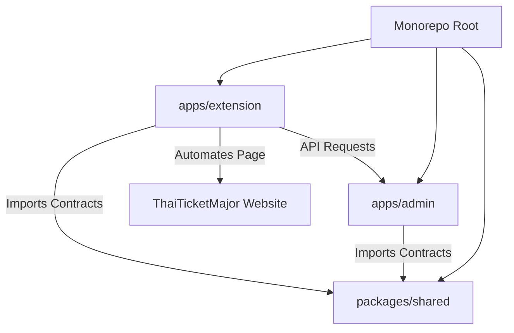
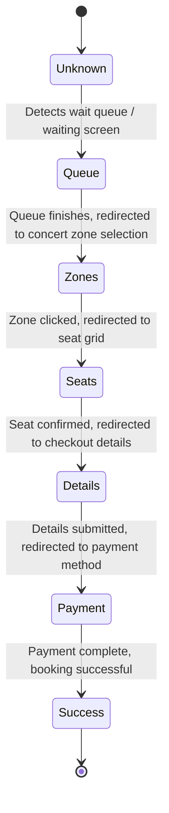

# Ticket Helper Platform - System Context & Architecture

This document provides a comprehensive English overview of the system architecture, component relationships, data models, and the automation engine state machine of the **Ticket Helper Platform**.

---

## 1. System Overview

The **Ticket Helper Platform** is a pnpm-based monorepo designed to manage ticket-booking accounts and run an automated Chrome extension workflow to assist users booking tickets on **ThaiTicketMajor (TTM)**.

The system is comprised of:
1. **Admin Panel (`apps/admin`)**: A full-stack Next.js web application for provisioning extension accounts, managing subscription expiration dates, and tracking/enforcing device limits.
2. **Chrome Extension (`apps/extension`)**: A Manifest V3 extension featuring a side panel interface that registers a user’s device, stores booking settings, and automates/guides page transitions, seat selection, and checkout on the TTM booking website.
3. **Shared Contracts (`packages/shared`)**: Shared TypeScript interfaces, schemas, constants, and utilities.

---

## 2. Architecture & Directory Structure

The repository is structured as follows:

### 2.1 Component breakdown
*   **`apps/admin`**: Built on Next.js 15 (App Router) and React 19. It uses PostgreSQL with Prisma ORM for data storage, and Redis for caching user access control lists.
*   **`apps/extension`**: Built on React 19, TypeScript, Tailwind CSS, and compiled using Vite and CRXJS. The extension includes a side panel, background service worker, and page-injected content scripts.
*   **`packages/shared`**: Reusable TypeScript contracts published locally in the monorepo workspace under `@ticket-helper/shared`.

---

## 3. The Automation Engine State Machine

The automation engine operates in `apps/extension/src/content/ttm-engine.ts` and orchestrates actions based on the current page state detected via `detectTtmPageState()`.

### 3.1 Page State Detection Matrix

| State Name | URL / Content Clues | Associated Actions / Logic |
| :--- | :--- | :--- |
| **`queue`** | Content contains `"queue"`, `"กรุณารอสักครู่"` | Remains active; monitors page until redirect occurs. |
| **`zones`** | URL includes `zones.php` / Content contains `"ขั้นตอนที่ 1/4"`, `"ที่นั่งว่าง"` | Renders overlay. Selects concert round, identifies and clicks the specified target zone. |
| **`seats`** | Content contains `"เลือกที่นั่ง"`, `"ยืนยันที่นั่ง"`, `"เลือกโซนอื่น"` / SVG seat paths present | Parses seat coordinates, skips reserved seats, executes seat-selection algorithm, and clicks confirmation. |
| **`details`** | Content contains `"ชื่อบนบัตร"`, `"วิธีการรับบัตร"`, `"เลขบัตรประชาชน"` | Autofills customer name and ID credentials from the configuration preset. |
| **`payment`** | URL includes `paymentall.php` / Content contains `"วิธีชำระเงิน"` | Highlights or clicks the preferred payment method, stopping automation for manual checkout completion. |
| **`success`**| Content contains `"สำเร็จ"`, `"success"` | Completes active run and reports success to the side panel log. |
| **`unknown`**| Other pages | Automation pauses until a recognized state is encountered. |

### 3.2 WAF Evasion & Event Simulation
To prevent ThaiTicketMajor’s Web Application Firewall (WAF) from blocking requests:
*   **Sequential Clicks**: Elements are not clicked via inline scripts. Instead, the engine dispatches a native MouseEvent sequence (`mousedown` -> `mouseup` -> `click`) via `dispatchMouseSequence(element, x, y)`.
*   **Map Coordinate Calculations**: TTM uses image maps (`<map><area>`). The engine computes relative coordinates based on the image's viewport and dispatches simulated mouse events directly to the target area's center point.
*   **Adaptive Delays**: The execution loop dynamically adjusts delays between commands according to the user's active configuration preset:
    *   `FAST`: Short delays (~10ms–140ms) for high-speed grabbing.
    *   `SAFE`: Long delays (~200ms–2600ms) to mimic realistic human interactions.
    *   `MEDIUM` (Default): Balanced delays (~30ms–800ms).

---

## 4. Admin API & Data Model

The admin backend enforces subscription control and prevents unauthorized account sharing.

### 4.1 Database Schema (Prisma)
The database structure is configured inside `apps/admin/prisma/schema.prisma`:

*   **`Admin`**: Stores administrative credentials for dashboard management.
*   **`User`**: Represetns a provisioned ticket-booking account with an `email`, expiration date (`expiresAt`), and a maximum allowed concurrent devices limit (`deviceLimit`).
*   **`Device`**: Binds a unique `deviceKey` and `deviceName` to a `User` account. Each time the extension logs in, it registers the client device ID. If the devices exceed `deviceLimit`, further logins are blocked.

### 4.2 Redis Caching & Cache Invalidation
*   The admin API caches authenticated user payloads in Redis to scale performance.
*   When a user is modified (e.g., deactivated, expired, or device quota reset) via the admin dashboard, a Redis invalidation command is executed, forcing the extension background script to detect the state change and trigger an automatic logout.

---

## 5. Environment Variables & Setup

### 5.1 Admin Application (`apps/admin/.env`)
*   `DATABASE_URL`: PostgreSQL database connection string.
*   `DIRECT_URL`: Direct PostgreSQL URL (bypassing poolers like PgBouncer).
*   `REDIS_URL`: Redis server endpoint URL.
*   `JWT_SECRET`: Secret key used for signing session-based JSON Web Tokens.

### 5.2 Extension Application (`apps/extension/.env`)
*   `VITE_API_URL`: The HTTP endpoint of the Next.js admin API (e.g., `http://localhost:3000` for local dev).
